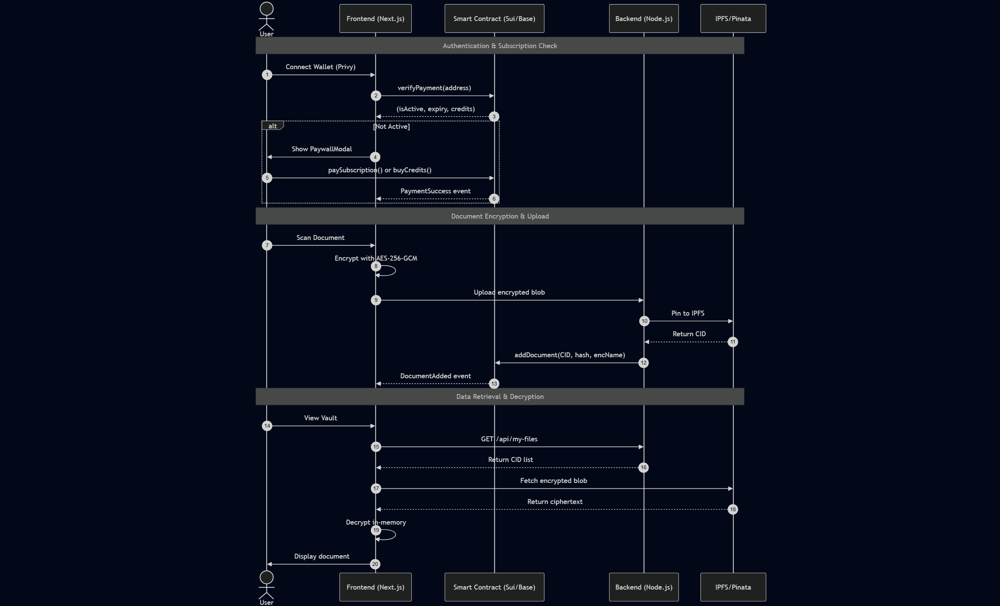

# How It Works



### Decentralized Onboarding & Gatekeeping

The journey begins with authentication via **Privy** or the **Coinbase Smart Wallet**. Unlike traditional apps that use email/password, SentryGate uses your **Base Wallet Address** as your unique identifier.

#### Authentication Flow

Immediately upon connection, the frontend triggers an on-chain query to the SentryGate Smart Contract calling the `checkAccess(address)` function.

Implementation:

* Privy authentication: [`PrivyLoginButton.tsx`](/broken/pages/388c482f49324659d99cad0b7e2113c6b6148811)
* Providers setup: [`providers.tsx`](/broken/pages/8c936631e8f20dbf5f89e3b7b504dc60ebe8f983)
* Privy config with Base Sepolia chain

#### The "Gate"

If the contract returns `false` (meaning no active x402 session), the user is presented with the **PaywallModal**.

Implementation:

* Access verification: [`verifyPayment()` function](/broken/pages/4869e85afa8d9ca7b5661354ccf1802cdac368cf#L103-L106)
* Returns: `(isActive, expiry, credits)`
* Logic: `isActive = (block.timestamp < subExpiry[user]) || (uploadCredits[user] > 0)`

#### Unlocking

Once a payment in **IDRX** is confirmed on the Base network, the smart contract updates the `userExpiry` mapping, and the app's core features are unlocked.

Implementation:

* Payment functions:
  * [`paySubscription()`](/broken/pages/4869e85afa8d9ca7b5661354ccf1802cdac368cf#L49-L63) - Updates `subExpiry[msg.sender]`
  * [`buyCredits()`](/broken/pages/4869e85afa8d9ca7b5661354ccf1802cdac368cf#L65-L71) - Increments `uploadCredits[msg.sender] += 5`
* IDRX token integration: [`MockIDRX.sol`](/broken/pages/2f634951ccfbb28bd2d6dfcaa4f3d190090af9e7)



### High-Fidelity Document Capture

Once inside the vault, the user accesses the **Scanner component**.

#### Hardware Interfacing

The component uses the `navigator.mediaDevices.getUserMedia` API to access the camera stream.

Implementation:

* Scanner component: [`Scanner.tsx`](/broken/pages/cf0bb4b8f750e5905b6aba8f9e78f1038ad114a2)
* React-webcam library integration (dependency in package.json)
* Scan page: [`/scan/page.tsx`](/broken/pages/0c066dba17c6fcae836219c5d9fa4ff00f7145f3)

#### Optimized Processing

To prevent uploading massive raw image files, SentryGate processes the frame through an internal **HTML5 Canvas**. It performs:

* Real-time cropping
* Compression
* Format conversion (WebP)

This ensures the file is lightweight but remains high-resolution for legal readability.



### The Cryptographic Locking (Client-Side)

This is where SentryGate differs from custodial cloud services. **Before a single bit of the document is sent to the internet, it must be locked.**

#### Deterministic Entropy

The user is prompted for a `personal_sign`. The resulting signature is used as the high-entropy seed for our Key Derivation Function (KDF).

#### AES-256-GCM Transformation

Using the **Web Crypto API**, the document blob is encrypted using **AES-256-GCM**. This process produces:

* **Ciphertext** - The encrypted document
* **Initialization Vector (IV)** - Random nonce for encryption
* **Authentication Tag** - Ensures integrity

The **"Raw" document never leaves the user's browser memory**.

Implementation:

* Client-side encryption in frontend
* Web Crypto API (`crypto.subtle`) for AES-256-GCM
* PBKDF2 key derivation from wallet signature
* 100,000+ iterations with unique salt



### Distributed Archiving

The encrypted package is sent to the **SentryGate Backend API**.

#### IPFS Pinning

The backend acts as a secure relay to **Pinata**. The file is uploaded to the **InterPlanetary File System (IPFS)**, a peer-to-peer network.

Implementation:

* Upload API endpoint: Express `POST /api/upload` ([`index.js:130-168`](/broken/pages/b1724c0a8483ef82a35b32509fcfc9371588b5c1#L130-L168))
* Pinata integration for IPFS pinning
* Returns CID (Content Identifier)

#### CID Generation

IPFS returns a **Content Identifier (CID)**—a unique cryptographic hash representing the file. This CID is then:

* Stored in **MySQL database** via MySQL2 connection pool
* Posted to smart contract via [`addDocument()`](/broken/pages/4869e85afa8d9ca7b5661354ccf1802cdac368cf#L74-L100)
* Associated with the user's wallet address on-chain

Implementation:

* Backend database: MySQL2 connection pool ([`index.js:25-33`](/broken/pages/b1724c0a8483ef82a35b32509fcfc9371588b5c1#L25-L33))
* Database tables: [`migrate.js`](/broken/pages/d189efcd577a2767d7aba006e35cf4c9d61d0190)
* On-chain storage in [`userDocuments` mapping](/broken/pages/4869e85afa8d9ca7b5661354ccf1802cdac368cf#L29)



### Secure Retrieval & Decryption

When a user visits their **Vault Gallery**, the system retrieves encrypted CIDs and decrypts blobs in-memory without persisting raw documents to disk.

#### Retrieval Process



Fetch CID list from backend (encrypted CIDs associated with the user's wallet).



Download the encrypted blob directly from the IPFS gateway in the browser.



Use the cached master key (derived from the earlier login signature) to decrypt the blob in-memory.



Create an ephemeral Blob URL for viewing so the decrypted file is never stored permanently on local disk.



Implementation:

* My files API: Express `GET /api/documents/:walletAddress` ([`index.js:199-209`](/broken/pages/b1724c0a8483ef82a35b32509fcfc9371588b5c1#L199-L209))
* Vault page: [`/vault/page.tsx`](/broken/pages/5d7727fd31d02364db597baf8dc5e92b71bdd0ce)
* On-chain verification via [`getMyDocs()`](/broken/pages/4869e85afa8d9ca7b5661354ccf1802cdac368cf#L108-L110)



***

### Workflow Summary

<figure><figcaption></figcaption></figure>


Zero-Trust Architecture: At no point does SentryGate have access to your unencrypted documents. The platform operates purely on encrypted data and on-chain proofs.

