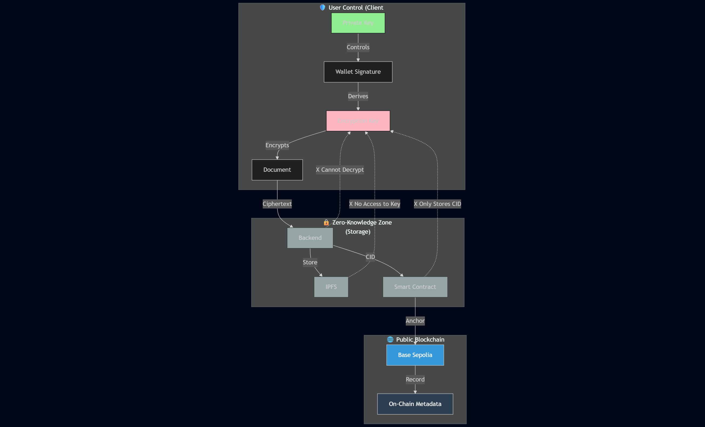

# Security & Privacy

SentryGate is built upon a **Zero-Knowledge Architecture** foundation. Our security is not just a policy, but a **mathematical guarantee**.

## Architecture Overview

```mermaid
graph LR
    subgraph "Client Side (Browser)"
        A[Raw Document]
        B[Web Crypto API]
        C[AES-256-GCM]
        D[Encrypted Blob]
    end
    
    subgraph "Zero-Knowledge Barrier"
        E[No Plaintext Crosses]
    end
    
    subgraph "Backend/IPFS"
        F[Encrypted Storage]
        G[Cannot Decrypt]
    end
    
    A -->|Encrypt| B
    B -->|Generate| C
    C -->|Output| D
    D -->|Through| E
    E -->|Store| F
    F -.X.-|No Access| G
    
    style A fill:#90EE90
    style D fill:#FFB6C1
    style E fill:#FF6B6B
    style G fill:#95A5A6
```

## 1. Client-Side Cryptography (The "Black Box")

All sensitive data is processed in an **isolated environment** within the user's browser.

### AES-256-GCM: Military-Grade Standard

We use the **AES-256-GCM** algorithm (Advanced Encryption Standard with Galois/Counter Mode).

Why GCM Mode?

* **Confidentiality**: Data is encrypted and unreadable
* **Authenticated Encryption**: Provides assurance that if even one bit of data on IPFS is changed by a hacker, the decryption process will automatically fail
* **No Tampering**: Authentication tag prevents manipulation

Implementation:

* Web Crypto API (`crypto.subtle`)
* 256-bit key length (military-grade)
* Unique IV (Initialization Vector) per encryption
* Authentication tag included in ciphertext

Code Example:

```javascript
// Encrypt document
const encryptedBlob = await crypto.subtle.encrypt(
  {
    name: 'AES-GCM',
    iv: randomIV,
    tagLength: 128
  },
  derivedKey,
  documentBuffer
);
```

### No Raw Data on Wire

Raw data (diplomas, ID cards, etc.) **is never sent to the internet**. What leaves your device is only a pile of random characters (ciphertext).



### Scan & Encrypt

User scans document → Raw image in browser memory



### Local Encryption

Browser encrypts with AES-256-GCM → Ciphertext blob



### Transmit Ciphertext

Ciphertext sent to backend → **Never plaintext**



### Store on IPFS

Backend uploads to IPFS → **Still encrypted**



### Immutable Storage

IPFS stores forever → **Permanently encrypted**



Implementation References:

* Scanner component: [`Scanner.tsx`](/broken/pages/cf0bb4b8f750e5905b6aba8f9e78f1038ad114a2)
* Upload API: Express `POST /api/upload` ([`index.js:130-168`](/broken/pages/b1724c0a8483ef82a35b32509fcfc9371588b5c1#L130-L168))

## 2. Elimination of Master Passwords

SentryGate eliminates the human weakness of easily guessable passwords.

### Wallet-Derived Keys

Your encryption key is **derived from your digital wallet signature**.



### Connect Wallet

User connects wallet (Privy)



### Request Signature

App requests signature: "Authorize SentryGate Vault"



### Wallet Signs

Wallet signs message with private key



### Signature as Seed

Signature used as high-entropy seed



### Derive Key

Key derived using PBKDF2



Benefits:

* ✅ No password to remember
* ✅ No password to store
* ✅ No password to leak
* ✅ Deterministic (same signature = same key)
* ✅ Works across devices

Implementation:

* Privy authentication: [`PrivyLoginButton.tsx`](/broken/pages/388c482f49324659d99cad0b7e2113c6b6148811)
* Wallet signature via `personal_sign`

### PBKDF2 Stretched

Your signature is processed through **100,000 hashing iterations**.

PBKDF2 Parameters:

* **Algorithm**: HMAC-SHA256
* **Iterations**: 100,000+
* **Salt**: Unique cryptographic salt per user
* **Key Length**: 256 bits

Why This Matters: Technically, this makes brute-force attacks **impossible** because it requires enormous computational power to guess just one key.

Time to Crack (theoretical):

* 1 attempt = 100,000 HMAC-SHA256 operations
* Modern CPU: \~100,000 attempts/second
* With 256-bit key space: **2^256 / 100,000 ≈ 10^71 years**

Code Example:

```javascript
// Derive encryption key from signature
const derivedKey = await crypto.subtle.deriveBits(
  {
    name: 'PBKDF2',
    salt: uniqueSalt,
    iterations: 100000,
    hash: 'SHA-256'
  },
  signature,
  256
);
```

## 3. Data Sovereignty on IPFS

Even though files are stored on a public network (IPFS), that data remains **useless** to anyone without your key.

### Unlinkable Identity

Metadata in our database **does not store personal information** that can directly identify you, only wallet addresses and encrypted file references.

What We Store:

* ✅ Wallet address (public blockchain address)
* ✅ IPFS CID (content identifier)
* ✅ Encrypted document name
* ✅ SHA-256 hash
* ✅ Timestamp

What We DON'T Store:

* ❌ Encryption keys
* ❌ Wallet private keys
* ❌ Document content
* ❌ Personal information
* ❌ Real document names

Implementation:

* Backend database: MySQL2 + MySQL
* [`documents` table](/broken/pages/d189efcd577a2767d7aba006e35cf4c9d61d0190)
* No PII (Personally Identifiable Information)

### Censorship Resistance

Because it's stored on IPFS, your documents **cannot be unilaterally deleted** by any central authority.

IPFS Properties:

* **Decentralized**: Files distributed across global peer network
* **Content-Addressed**: CID is cryptographic hash of content
* **Immutable**: Cannot change file without changing CID
* **Persistent**: Pinned files stay available forever
* **Censorship-Resistant**: No single point of control

Implementation:

* Pinata pinning service
* CID stored on-chain: [`Document.cid`](/broken/pages/4869e85afa8d9ca7b5661354ccf1802cdac368cf#L23)
* Retrieval via IPFS gateway

***

## Security Guarantees Table

| Threat             | Traditional Cloud          | SentryGate                    | Protection Method            |
| ------------------ | -------------------------- | ----------------------------- | ---------------------------- |
| **Data Breach**    | ⚠️ All user data exposed   | ✅ Only encrypted blobs        | Client-side encryption       |
| **Insider Threat** | ⚠️ Admin can read files    | ✅ Zero-knowledge architecture | No decryption keys           |
| **Password Leak**  | ⚠️ Account compromise      | ✅ No passwords to leak        | Wallet-derived keys          |
| **MITM Attack**    | ⚠️ Can intercept plaintext | ✅ Only ciphertext transmitted | End-to-end encryption        |
| **Censorship**     | ⚠️ Platform can delete     | ✅ IPFS decentralization       | Distributed storage          |
| **Tampering**      | ⚠️ Files can be modified   | ✅ Auth tag + on-chain hash    | GCM mode + SHA-256           |
| **Loss of Access** | ⚠️ Password forgotten      | ✅ Wallet signature            | Deterministic key derivation |

***

## Privacy-Preserving Architecture

<figure><figcaption></figcaption></figure>

***

## Key Security Principles

### Defense in Depth

Multiple layers of security:

* Client-side encryption
* Decentralized storage
* On-chain access control
* ReentrancyGuard protection
* Custom errors for gas efficiency

### Cryptographic Guarantees

Not policy-based, but **mathematically proven**:

* AES-256: Proven secure by NIST
* PBKDF2: Standardized key derivation
* SHA-256: Collision-resistant hashing
* IPFS: Content-addressed immutability

### Minimal Trust

Zero-knowledge design:

* Platform never sees plaintext
* No "master keys" on server
* User controls decryption
* On-chain verification

### Transparency

Open and auditable:

* Open-source smart contracts
* Public blockchain records
* Event emissions for all actions
* Verifiable on-chain state

***

## Security Best Practices for Users

### DO ✅

* **Keep wallet private key secure** - It's your master key
* **Verify contract addresses** - Always check on BaseScan
* **Use hardware wallet** - For maximum security
* **Backup wallet seed phrase** - Store offline securely
* **Verify IPFS CID** - Cross-check on-chain vs retrieved

### DON'T ❌

* **Share wallet private key** - Never, ever
* **Screenshot seed phrase** - No digital copies
* **Use same wallet for trading** - Separate hot/cold wallets
* **Trust unverified contracts** - Always verify source code
* **Ignore transaction warnings** - Read MetaMask prompts

***

## Compliance & Privacy

### GDPR Compatibility

* **Right to be Forgotten**: Encrypted data on IPFS is effectively "forgotten" without decryption key
* **Data Minimization**: Only essential metadata stored
* **Privacy by Design**: Zero-knowledge architecture
* **User Control**: Users hold encryption keys

### No Personal Data Collection

SentryGate does **NOT** collect:

* Email addresses
* Phone numbers
* Real names
* Government IDs
* Location data
* Browsing history

Only public wallet addresses (already on blockchain).

***

## Smart Contract Security

**Implementation**: [`SentryGate.sol`](/broken/pages/4869e85afa8d9ca7b5661354ccf1802cdac368cf)

### Security Features



### ReentrancyGuard

[Line 8](/broken/pages/4869e85afa8d9ca7b5661354ccf1802cdac368cf#L8)\
Protects against reentrancy attacks — applied to all state-changing functions.



### Ownable

[Line 8](/broken/pages/4869e85afa8d9ca7b5661354ccf1802cdac368cf#L8)\
Access control for admin functions — only owner can update fees.



### Custom Errors

[Lines 16-19](/broken/pages/4869e85afa8d9ca7b5661354ccf1802cdac368cf#L16-L19)\
Gas-efficient error handling with clear revert reasons.



### Immutable Logic

Once deployed, core logic cannot change — transparent and auditable.



***

> **Security is not a feature, it's a mathematical certainty. Trust the cryptography, not the company.**

***

## Audit Recommendations

For production deployment, recommend:



### Smart Contract Audit

Engage third-party auditors such as OpenZeppelin, Trail of Bits, or Consensys Diligence.



### Frontend Security Review

Check Web Crypto API usage and client-side implementation.



### Penetration Testing

Test IPFS integration and end-to-end system resilience.



### Gas Optimization

Reduce deployment and transaction costs where possible.



### Formal Verification

Prove contract correctness for critical logic.



**Current Status**: Hackathon prototype - NOT audited for production use.
