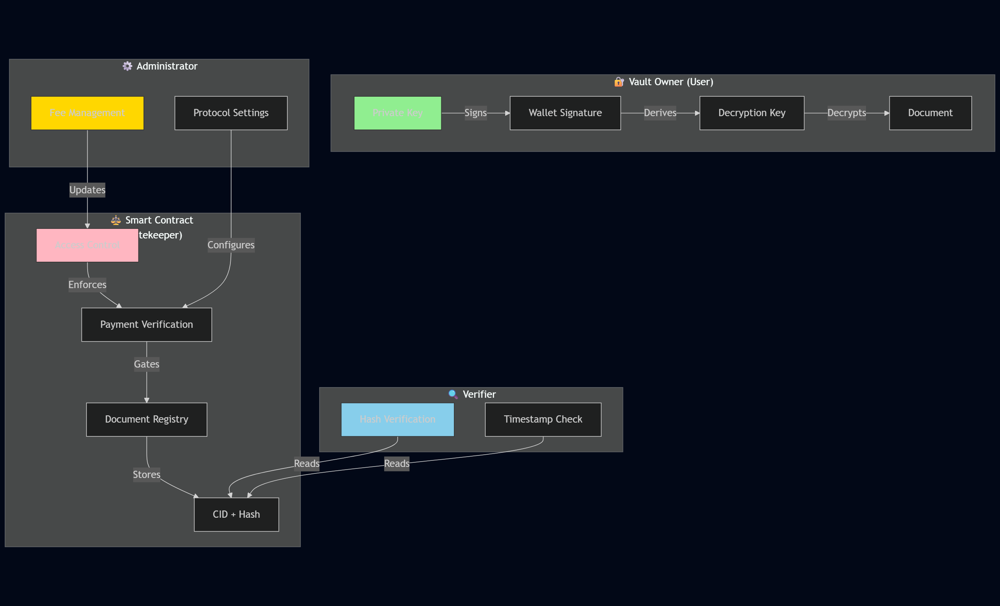

# User Roles



### The Vault Owner (The User)

The most powerful role in the SentryGate ecosystem. **The User is the only entity that can access the content of the vaulted documents.**

#### Cryptographic Authority

Only the User has the private key (managed via their wallet) required to sign the message that derives the AES decryption key.

Implementation:

* Wallet-based authentication via Privy: [`PrivyLoginButton.tsx`](/broken/pages/388c482f49324659d99cad0b7e2113c6b6148811)
* Signature-based key derivation (PBKDF2)
* Client-side encryption/decryption only

#### Operational Scope

Full read/write access to their personal vault.

Implementation:

* View documents: [`getMyDocs()`](/broken/pages/4869e85afa8d9ca7b5661354ccf1802cdac368cf#L108-L110) - returns `userDocuments[msg.sender]`
* Add documents: [`addDocument()`](/broken/pages/4869e85afa8d9ca7b5661354ccf1802cdac368cf#L74-L100) - only `msg.sender` can add to their vault

#### Requirements

Must maintain an **active x402 Gate Access** by providing IDRX payments to the smart contract.

Implementation:

* Payment verification in [`addDocument()` lines 78-90](/broken/pages/4869e85afa8d9ca7b5661354ccf1802cdac368cf#L78-L90)
* Reverts with [`PaymentRequired()` error](/broken/pages/4869e85afa8d9ca7b5661354ccf1802cdac368cf#L18) if inactive



### The Smart Contract (The Gatekeeper)

An autonomous, code-defined role that operates with **100% transparency** on the Base network.

#### Authority

The contract is the final arbiter of who can access the storage and scanning features.

Implementation: [`SentryGate.sol`](/broken/pages/4869e85afa8d9ca7b5661354ccf1802cdac368cf)

#### Logic

It strictly enforces the `userExpiry` timestamp. It doesn't care about identity; it only cares about **valid, on-chain proof of payment**.

Implementation:

```solidity
// Line 78-90: Access enforcement logic
bool isSubscribed = block.timestamp < subExpiry[msg.sender];
bool hasCredits = uploadCredits[msg.sender] > 0;

if (isSubscribed) {
    // Lolos via Langganan
} else if (hasCredits) {
    // Lolos via Kredit (potong 1)
    uploadCredits[msg.sender] -= 1;
} else {
    // GAGAL: Revert dengan Custom Error
    revert PaymentRequired();
}
```

#### Immutability

Once a payment is made, the access right is **locked into the blockchain**, and not even the administrators can revoke it before the expiry time.

Implementation:

* Subscription expiry: [`subExpiry` mapping](/broken/pages/4869e85afa8d9ca7b5661354ccf1802cdac368cf#L30)
* Upload credits: [`uploadCredits` mapping](/broken/pages/4869e85afa8d9ca7b5661354ccf1802cdac368cf#L31)
* No function exists to revoke access prematurely



### The Protocol Administrator

A maintenance-focused role with **restricted capabilities** to ensure the platform's health.

#### Administrative Scope

Can update the IDRX fee required for vault access and withdraw protocol revenue from the smart contract.

Implementation:

* Contract inherits [`Ownable`](/broken/pages/4869e85afa8d9ca7b5661354ccf1802cdac368cf#L8)
* Owner set in constructor: [`Ownable(msg.sender)`](/broken/pages/4869e85afa8d9ca7b5661354ccf1802cdac368cf#L37)
* Can manage:
  * Fee recipient address ([`feeRecipient`](/broken/pages/4869e85afa8d9ca7b5661354ccf1802cdac368cf#L11))
  * Subscription and credit pricing ([`subPrice`, `creditPrice`](/broken/pages/4869e85afa8d9ca7b5661354ccf1802cdac368cf#L13-L14))

#### Security Guardrail

**CANNOT access, view, or modify any files** stored in the vault. Because the encryption is client-side, the administrator only sees encrypted blobs of data on IPFS.

Architecture ensures:

* Encryption happens in browser before upload
* Admin has no access to decryption keys (derived from user wallet signature)
* IPFS stores only encrypted ciphertext
* No backdoor functions in smart contract



### The Verifier (Read-Only/Proof-Based)

A role intended for third parties such as **employers, universities, or banks**.

#### Capabilities

Can verify the cryptographic hash of a document against the on-chain record to ensure it hasn't been tampered with.

Implementation:

* Anyone can call [`getMyDocs()`](/broken/pages/4869e85afa8d9ca7b5661354ccf1802cdac368cf#L108-L110) if they know the user's address
* Returns array of `Document` structs containing:
  * `cid` - IPFS content identifier
  * `docHash` - SHA-256 hash for verification
  * `encryptedName` - Encrypted filename (unreadable without key)
  * `timestamp` - Proof of when document was uploaded

#### Privacy

They can only **verify integrity**; they cannot see the document content unless the Vault Owner explicitly provides the decryption key or a view-only proof.

Zero-Knowledge guarantee:

* Verifier sees only: CID, hash, encrypted name, timestamp
* Cannot decrypt actual document content
* Cannot access the file without user sharing decryption key



***

### Role Comparison Table

| Role               | Access Level | Capabilities                    | Limitations                     |
| ------------------ | ------------ | ------------------------------- | ------------------------------- |
| **Vault Owner**    | Full         | Upload, view, decrypt documents | Must maintain active payment    |
| **Smart Contract** | Gatekeeper   | Enforce payment, track expiry   | Immutable logic, no backdoors   |
| **Administrator**  | Limited      | Update fees, manage protocol    | Cannot access encrypted content |
| **Verifier**       | Read-Only    | Verify hashes, check timestamps | Cannot decrypt or modify        |


SentryGate ensures that every role is balanced by cryptographic proofs, making "Trust" a mathematical certainty.


***

### Security Architecture

<figure><figcaption></figcaption></figure>

Each role is cryptographically isolated, ensuring the Zero-Knowledge architecture remains intact.
